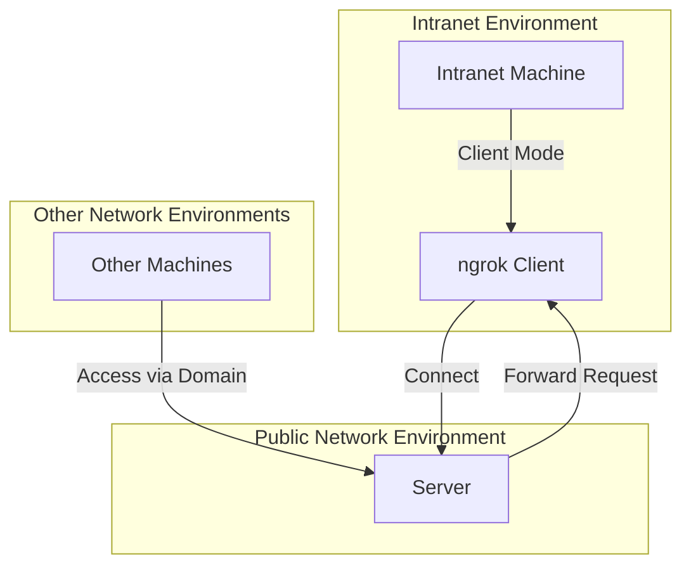

# simpleNg

## Introduction

A simple tool for exposing local HTTP services to the public internet, serving as an alternative to ngrok. It includes both server and client modes in a single executable file.

You will need a server with a public network environment and a wildcard domain name pointing to your server (can be a multi-level domain, such as `*.simple-ng.example.com` . If using a server in mainland China, the domain name needs to be otherwise registered).

You can place Nginx in front of the server to share the HTTP/HTTPS ports with other services on your server. Additionally, you can use free domain certificates from services like Let's Encrypt to provide HTTPS services.

Currently, it only supports forwarding local HTTP services to the public internet and does not support forwarding WebSocket services. This is because the connection between the server and client is established using WebSocket to forward requests.



## Usage

Preparation:
1. A server accessible over the public network
2. A publicly accessible wildcard domain name, such as `*.simple-ng.example.com`, resolving to your server

**Server Side**:

1. Download the compiled binary file.
2. Run `./simpleNg -type=server -port=8066` to start the server
   1. `type` is the operation mode, `server` for server mode
   2. `port` is the port the server listens on, defaulting to 8066
   3. You can use `nohup ./simpleNg -type=server -port=8066 > ./server.log 2>&1 &` to run the server in the background, with logs output to `./server.log`. Alternatively, you can follow some online tutorials to configure it as a self-starting service.
3. Use `Nginx` to proxy your `simpleNg` service (optional). Below is a sample configuration file for reference:


```nginx

server {
    listen 80;
    listen 443 ssl http2;
    server_name *.simple-ng.example.com;
    
    if ($server_port !~ 443){
        rewrite ^(/.*)$ https://$host$1 permanent;
    }
    
    ssl_certificate /etc/letsencrypt/live/simple-ng.example.com/fullchain.pem;
    ssl_certificate_key /etc/letsencrypt/live/simple-ng.example.com/privkey.pem;
    ssl_protocols TLSv1 TLSv1.1 TLSv1.2;
    ssl_ciphers "EECDH+AESGCM:EDH+AESGCM:AES256+EECDH:AES256+EDH";
    ssl_prefer_server_ciphers on;
    ssl_session_cache shared:SSL:10m;
    ssl_session_timeout 10m;
    add_header Strict-Transport-Security "max-age=31536000";
    error_page 497  https://$host$request_uri;
    
    location / {
        proxy_pass http://127.0.0.1:8066;
        proxy_set_header Host $host;
        proxy_set_header X-Real-IP $remote_addr;
        proxy_set_header X-Forwarded-For $proxy_add_x_forwarded_for;
        proxy_set_header X-Forwarded-Proto $scheme;
        proxy_set_header Upgrade $http_upgrade;
        proxy_set_header Connection $connection_upgrade;
        proxy_redirect off;
        proxy_buffering off;
    }
}
```

**Client Side**:

The following example assumes you want to expose the local HTTP service at `127.0.0.1:8080` to the public internet.

1. Download the compiled binary file.
2. Run `./simpleNg -type=client -local=127.0.0.1:8080 -domain=testprefix.simple-ng.example.com` to start the client.
   1. `type` is the operation mode, `client` for client mode, can be omitted, defaulting to `client`
   2. `local` is the local HTTP service address the client wants to forward, such as `localhost:8080`. Defaults to `127.0.0.1:8080`
   3. `domain` is the public domain name the client wants to use. It must be a domain name that your server can receive (a specific domain under your configured wildcard domain). It cannot be duplicated on the same server. The following formats can be used:
      1. `ws://testprefix.simple-ng.example.com`
      2. `wss://testprefix.simple-ng.example.com`
      3. `testprefix.simple-ng.example.com` (without protocol prefix, will automatically try both ws and wss protocols)
      4. `testprefix.simple-ng.example.com:8066` (if your service is not proxied by Nginx to ports 80/443, you need to specify the port)

Note that on the same server, different clients must have different `domain` values; otherwise, the older client will be kicked offline.

Next, from any location, you can access `http(s)://testprefix.simple-ng.example.com` to reach the HTTP service at `127.0.0.1:8080` on your intranet machine.

For data security reasons, this project does not provide a demo server.

