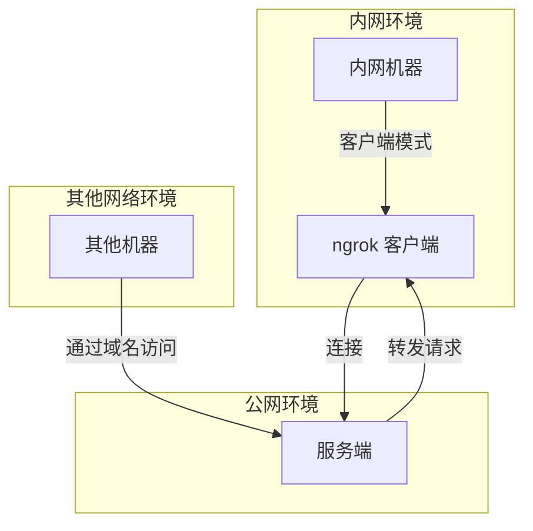

# simpleNg

## 介绍

一个简单的用来将本地 http 服务暴露到公网的工具，可替代 ngrok。在同一个可执行文件中包含服务端模式和客户端模式。

你需要一台公网环境的服务器，以及一个指向你服务器的泛域名（可以是多级域名，比如 *.simple-ng.example.com ，如果使用中国大陆的服务器，域名需要备案）。

你可以在服务端前置 Nginx 来与你的服务器上的其他服务共享 http / https 端口。同时你也可以借助 Let's Encrypt 等免费的域名证书来提供 https 服务。

目前只支持转发本地 http 服务到公网，不支持转发 websocket 服务。因为服务端和客户端之间使用 websocket 来建立连接转发请求。


## 使用

提前准备：
1. 一台可以公网访问的服务器
2. 一个可以公网访问的泛域名，比如 `*.simple-ng.example.com` ，解析到你的服务器 

**服务器端**：

1. 下载编译好的二进制文件。
2. 运行 `./simpleNg -type=server -port=8066` 启动服务端
   1. `type` 运行模式，`server` 服务端模式
   2. `port` 服务端监听端口，默认为 8066
   3. 你可以使用 `nohup ./simpleNg -type=server -port=8066 > ./server.log 2>&1 &` 来将服务端运行在后台，同时将日志输出到 `./server.log`。或者使用网络上的一些教程来将其配置为一个自启动的服务。
3. 使用 `Nginx` 代理你的 `simpleNg` 服务（可跳过），下面是一个可以参考的配置文件：

```nginx

server {
    listen 80;
    listen 443 ssl http2;
    server_name *.simple-ng.example.com;
    
    if ($server_port !~ 443){
        rewrite ^(/.*)$ https://$host$1 permanent;
    }
    
    ssl_certificate /etc/letsencrypt/live/simple-ng.example.com/fullchain.pem;
    ssl_certificate_key /etc/letsencrypt/live/simple-ng.example.com/privkey.pem;
    ssl_protocols TLSv1 TLSv1.1 TLSv1.2;
    ssl_ciphers "EECDH+AESGCM:EDH+AESGCM:AES256+EECDH:AES256+EDH";
    ssl_prefer_server_ciphers on;
    ssl_session_cache shared:SSL:10m;
    ssl_session_timeout 10m;
    add_header Strict-Transport-Security "max-age=31536000";
    error_page 497  https://$host$request_uri;
    
    location / {
        proxy_pass http://127.0.0.1:8066;
        proxy_set_header Host $host;
        proxy_set_header X-Real-IP $remote_addr;
        proxy_set_header X-Forwarded-For $proxy_add_x_forwarded_for;
        proxy_set_header X-Forwarded-Proto $scheme;
        proxy_set_header Upgrade $http_upgrade;
        proxy_set_header Connection $connection_upgrade;
        proxy_redirect off;
        proxy_buffering off;
    }
}
```

**客户端**：

下面的例子假设你要将本地 `127.0.0.1:8080` 的 http 服务暴露到公网。

1. 下载编译好的二进制文件。
2. 运行 `./simpleNg -type=client -local=127.0.0.1:8080 -domain=testprefix.simple-ng.example.com` 启动客户端。
   1. `type` 运行模式，`client` 客户端模式，可省略，默认为 `client`
   2. `local` 客户端希望转发的本地 http 服务地址，如 `localhost:8080`。默认为 `127.0.0.1:8080`
   3. `domain` 客户端希望使用的公网域名。必须是您服务器端可接收的域名（您配置的泛域名下的某一个具体域名）。在同一个服务端上不可重复。可以使用下面的几种形式：
      1. `ws://testprefix.simple-ng.example.com`
      2. `wss://testprefix.simple-ng.example.com`
      3. `testprefix.simple-ng.example.com` （不带协议前缀，会自动分别尝试 ws 和 wss 协议）
      4. `testprefix.simple-ng.example.com:8066` （如果你的服务没有使用 nginx 代理到 80/443 端口，需要指定端口）

需要注意的是，在同一个服务器上，不同客户端的 `domain` 必须不同，否则旧客户端会被踢下线。

接下来在任意位置，访问 `http(s)://testprefix.simple-ng.example.com` 即可访问到你内网机器中 `127.0.0.1:8080` 的 http 服务。

因保护数据安全，本项目不提供演示服务器。